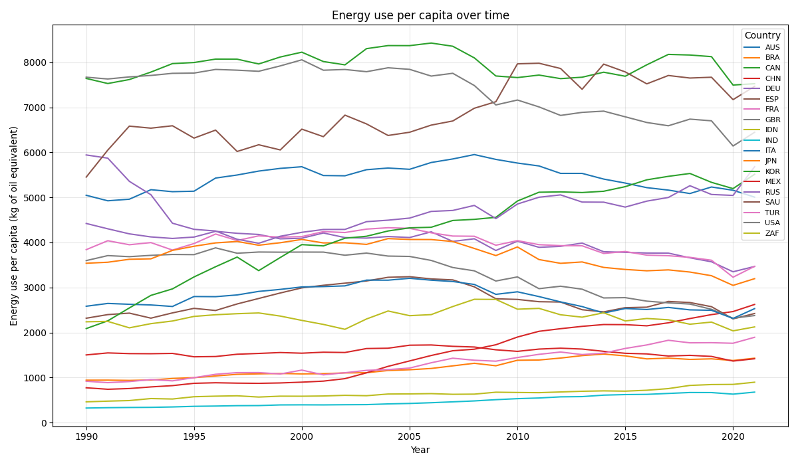
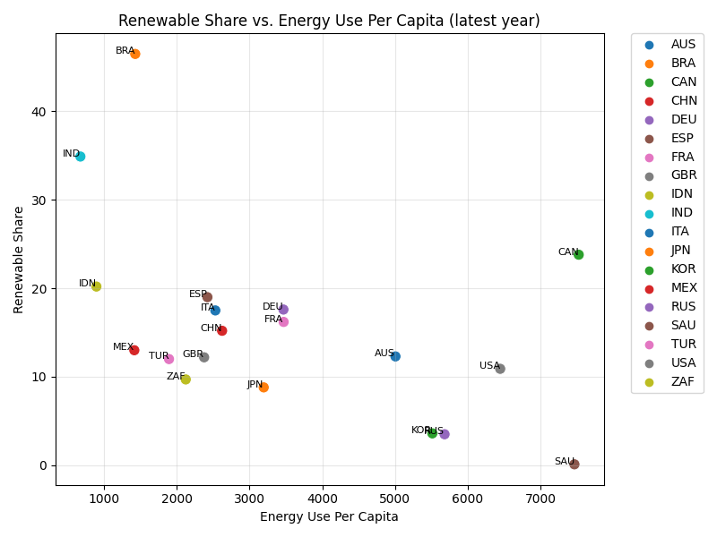
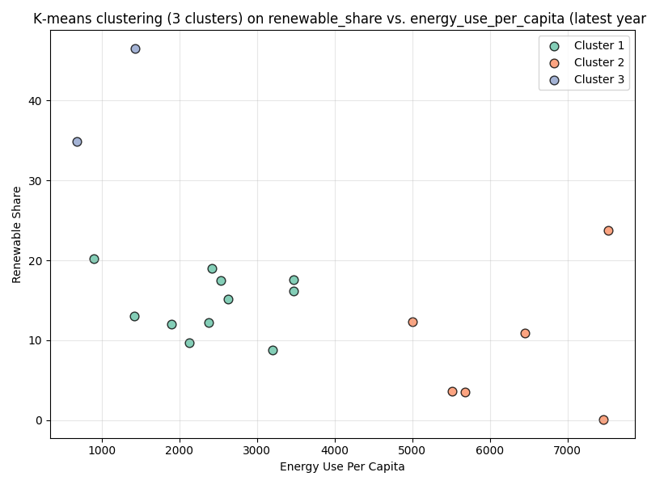
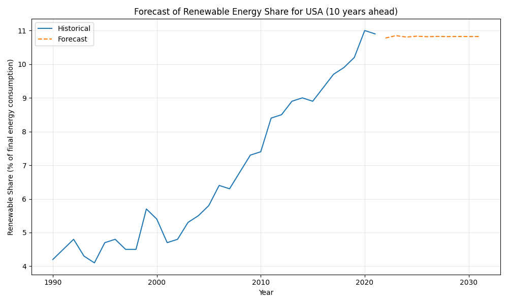

# Global Renewable Energy & Energy Use Analysis: Power BI and R Project

## Overview

Understanding how countries consume and produce energy is essential for tackling energy poverty and climate change.  
According to *Our World in Data*, the world lacks a safe, low‑carbon and cheap large‑scale energy infrastructure; hundreds of millions of people still lack access to sufficient energy and the dominance of fossil fuels drives climate change and other health impacts【550209266395930†L30-L40】.  To design policies that accelerate a clean energy transition, we need robust data on energy consumption, the mix of energy sources and economic factors.  *Our World in Data* curates a comprehensive energy dataset that includes metrics on primary energy consumption, per‑capita energy use, growth rates, energy mix, electricity mix and other relevant indicators【952735077677573†L2-L6】.  The dataset follows a 1‑row‑per‑location‑and‑year format and comes with a codebook describing each indicator【952735077677573†L14-L23】.

This project builds upon the World Bank’s World Development Indicators (WDI) to create an **advanced analytics and dashboard project** that employers will appreciate.  We pull three complementary energy and economic indicators from the WDI API:

- **Renewable energy consumption (% of total final energy consumption)** (`EG.FEC.RNEW.ZS`): measures the share of final energy consumption obtained from renewable sources【679290037218889†L1-L18】.
- **Energy use (kg of oil equivalent per capita)** (`EG.USE.PCAP.KG.OE`): estimates how much energy an average person consumes【384997618519143†L1-L8】.
- **Population (total)** (`SP.POP.TOTL`) and **GDP per capita (constant 2015 US$)** (`NY.GDP.PCAP.KD`): provide demographic and economic context.

We fetch these indicators for a set of major energy‑consuming economies (USA, China, India, Japan, Russia, Germany, United Kingdom, France, Brazil, Canada, Australia, South Africa, Mexico, Saudi Arabia, Indonesia, Korea, Italy, Spain and Turkey) from 1990 onwards.  Additional derived metrics – total energy use and energy intensity (energy use per capita divided by GDP per capita) – are calculated.

## Data Processing

The `scripts/analysis.py` Python script performs the following steps:

1. **Retrieve indicators from the World Bank API.**  Using the `requests` library, each indicator is downloaded for all countries and merged on country code, country name and year.  Years before 1990 and non‑country aggregate codes are discarded.
2. **Filter to selected countries.**  The script keeps only our list of 19 major economies and drops rows without renewable‑energy or energy‑use values.
3. **Compute derived metrics.**  It calculates total energy use (energy use per capita multiplied by population) and energy intensity (energy use per capita divided by GDP per capita).
4. **Write a tidy dataset.**  The cleaned and enriched data are saved as `data/processed_data.csv`.  This file forms the basis for both the R analysis and the Power BI dashboard.
5. **Generate visualisations.**  The script produces several PNG charts with `matplotlib` and `seaborn` and stores them in the `figures/` folder.  These include trend lines for renewable share and energy use per capita, scatter plots comparing variables in the latest year, K‑means clustering results and an ARIMA forecast.

You can run the Python script with:

```bash
cd scripts
python analysis.py
```

## R Analysis

The companion script `scripts/analysis.R` mirrors the Python processing using **R** and **tidyverse** packages.  It reads `data/processed_data.csv`, reproduces the line charts, scatter plots, K‑means clustering and forecasts the USA’s renewable‑energy share using the `forecast` package.  The R script also writes its charts into `figures/` with a `_R` suffix so that you can compare the outputs from both languages.  Instructions for enabling R scripts in Power BI are provided below.

## Key Insights

After processing the latest available data (through 2021) we obtain several insights:

- **Brazil and India lead in renewable energy share.**  In 2021 Brazil’s renewable energy consumption accounted for about 46.5 % of final energy use, while India reached roughly 34.9 %.  Canada, Indonesia and Spain followed with shares above 19 %.
- **Saudi Arabia and Russia have minimal renewable penetration.**  Saudi Arabia’s renewable share was near zero (0.1 %), and Russia’s around 3.5 %.  Korea, Japan and South Africa also had renewable shares below 10 %.
- **Energy use per capita is highest in Canada and Saudi Arabia.**  Canada consumed about 7 525 kg of oil equivalent per person in 2021, followed closely by Saudi Arabia (~7 466 kg), the United States (~6 446 kg), Russia (~5 681 kg) and Korea (~5 514 kg).
- **Negative relationship between energy use and renewable share.**  Across all countries and years, renewable share and energy use per capita show a moderate negative correlation (≈ –0.56).  Countries with very high per‑capita energy consumption tend to rely more on fossil fuels.
- **Cluster patterns.**  K‑means clustering groups countries into three distinct clusters: (1) high energy use & low renewable share (USA, Saudi Arabia, Russia, Korea); (2) moderate energy use & moderate renewable share (Canada, Japan, Germany, etc.); (3) relatively lower energy use & high renewable share (Brazil, India, Indonesia, Spain).
- **USA renewable share forecast.**  A simple ARIMA model predicts that the USA’s renewable share could rise steadily over the next decade, but deeper modelling (e.g., with exogenous variables) would yield more robust forecasts.

## Power BI Dashboard Instructions

1. **Import the data.**  Open Power BI Desktop and choose **Get Data → Text/CSV**.  Browse to `data/processed_data.csv` and load the dataset.  Power BI will infer column types (ensure `year` is numeric).
2. **Build visuals.**  Use the *Line and stacked column chart* visual to replicate the trend lines:
   - Axis: `year`
   - Value: `renewable_share` (or `energy_use_per_capita`)
   - Legend: `country_code`
3. **Scatter charts.**  Create a scatter plot with `energy_use_per_capita` on the X‑axis and `renewable_share` on the Y‑axis.  Use `country_code` as the legend and enable data labels to display country codes.
4. **Clustering.**  Power BI supports clustering within scatter charts (Modeling → New group → Create clusters).  Alternatively, bring in the `cluster` column from our dataset if you run the R or Python clustering code first.
5. **R Visuals (optional).**  To embed custom R code in your report:
   - Enable **Options → R scripting** and specify your local R installation.
   - Add an **R script visual** to a report page.
   - In the R script editor, paste the relevant sections from `scripts/analysis.R` (e.g., to produce the forecast plot).  R visuals will execute locally and display within Power BI.

## Visualisations

The figures generated by the Python and R scripts illustrate key trends and relationships.  You can view the images directly from the `figures/` folder or embed them into a Power BI dashboard or report.  Below are thumbnails and descriptions of the primary charts:

| Chart | Description |
|---|---|
|  | **Renewable energy share over time (1990–2022).**  Each line shows the percentage of final energy consumption from renewable sources for a selected country.  Brazil and India show rapid increases, while countries like Saudi Arabia remain near zero. |
|  | **Energy use per capita over time.**  This chart highlights the wide variation in per‑person energy consumption: Canada and Saudi Arabia top the chart, while India and Indonesia remain much lower. |
|  | **Renewable share vs. energy use per capita (latest year).**  The negative slope illustrates that countries with higher per‑capita energy use tend to have lower renewable shares.  Points are labelled by country code for easy identification. |
|  | **K‑means clustering results.**  Countries are grouped into three clusters based on renewable share and energy use per capita.  Colours correspond to the clusters described in the Key Insights section. |
|  | **Forecast of the USA’s renewable share.**  An ARIMA model projects steady growth in renewable energy consumption through the next decade. |

If you run the R script (`analysis.R`), additional charts with a `_R` suffix will appear in the `figures/` folder.  These replicate the Python plots using **ggplot2** and can serve as a comparison between languages.

## Repository Structure

```
powerbi_r_project/
│
├── data/
│   └── processed_data.csv     # Tidy dataset built from the World Bank API
├── figures/
│   ├── renewable_share_trends.png
│   ├── energy_use_per_capita_trends.png
│   ├── renewable_vs_energyuse_scatter.png
│   ├── kmeans_clusters.png
│   ├── usa_renewable_share_forecast.png
│   ├── renewable_share_trends_R.png         # Same charts generated in R
│   ├── energy_use_per_capita_trends_R.png   # (when running the R script)
│   ├── renewable_vs_energyuse_scatter_R.png
│   ├── kmeans_clusters_R.png
│   └── usa_renewable_share_forecast_R.png
├── scripts/
│   ├── analysis.py     # Python script to fetch data and create charts
│   └── analysis.R      # R script to reproduce the analysis and plots
└── README.md           # Documentation (this file)
```

## Conclusion

This project demonstrates how **R** and **Power BI** can work together to deliver a data‑driven analysis of global energy consumption.  By combining open‑source scripts with interactive dashboards, you can explore trends, benchmark countries, perform clustering and forecasting, and present insights to stakeholders.  The modular structure allows you to extend the analysis to additional indicators (e.g., carbon emissions, electricity generation) or countries, and the clear separation of data retrieval, processing and visualisation makes the project easy to maintain and enhance.
